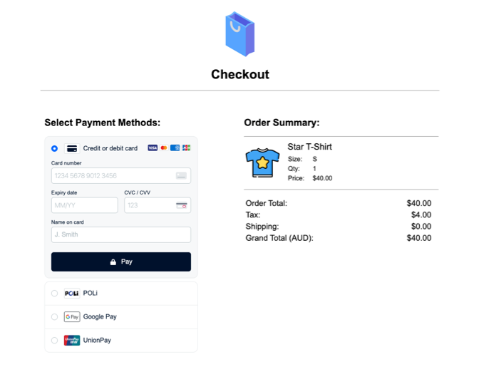

# dropInApp

dropInApp is a small light weight Python3.8 application, written using the Flask python framework as an exercise to explore the [Adyen Payment Gateway Drop-In Integration Method](https://docs.adyen.com/checkout/drop-in-web)




##### Supported/Tested Scenarios:
1. Credit Card (Visa - Without 3DS2)
2. Credit Card (Mastercard - Without 3DS2)
3. Local Payment - alipay Payment
4. Credit Card (Visa - 3DS2 (4917 XXXX XXXX XXXX))
5. Credit Card (Mastercard - 3DS2 (5454 XXXX XXXX XXXX))

## Installation

### Step 1

Move inside in the root directory of the application:
```
./dropInApp/                 // <-- ROOT directory
├── README.md
├── dropInApp/
│   ├── __init__.py
│   ├── app/
│   │   └── payments.py
│   ├── static/
│   │   ├── css/
│   │   │   └── main.css
│   │   └── img/
│   │       ├── favicon.ico
│   │       ├── shopping-bag.svg
│   │       ├── t-shirt.svg
│   │       ├── tick.svg
│   │       └── wrong.svg
│   └── templates/
│       ├── base.html
│       ├── checkout.html
│       ├── failure.html
│       ├── home.html
│       └── success.html
├── exampleParams.ini
├── params.ini
├── requirements.txt
├── run.sh
└── setup.sh
```

### Step 2

Run setup.sh: this creates a virtual environment, activate the environment and use the package manager [pip3](https://pip.pypa.io/en/stable/) to install the requirements.txt.

```bash
./setup.sh
```

### Step 3
Run virtual environment 'activate': 
```bash
. venv/bin/activate
```
### Step 4
Update the 'params.ini' file (running ./setup.sh will create this from the exampleParams.ini file) with the with your specific values:
```bash
# Params file example. Important replace with your own values 
[DEFAULT]
merchant_account = REPLACE_HERE_MERCHANT_ACCOUNT   
checkout_apikey = REPLACE_HERE_API_KEY
client_key = REPLACE_HERE_CLIENT_KEY
```

## Usage
Simply run the main project from the bash script:
```bash
./run.sh
```
And navigate to [http://localhost:5000](http://localhost:5000)

For test cards see article: [Adyen Test Cards](https://docs.adyen.com/development-resources/test-cards/test-card-numbers#credit-and-debit-cards)
